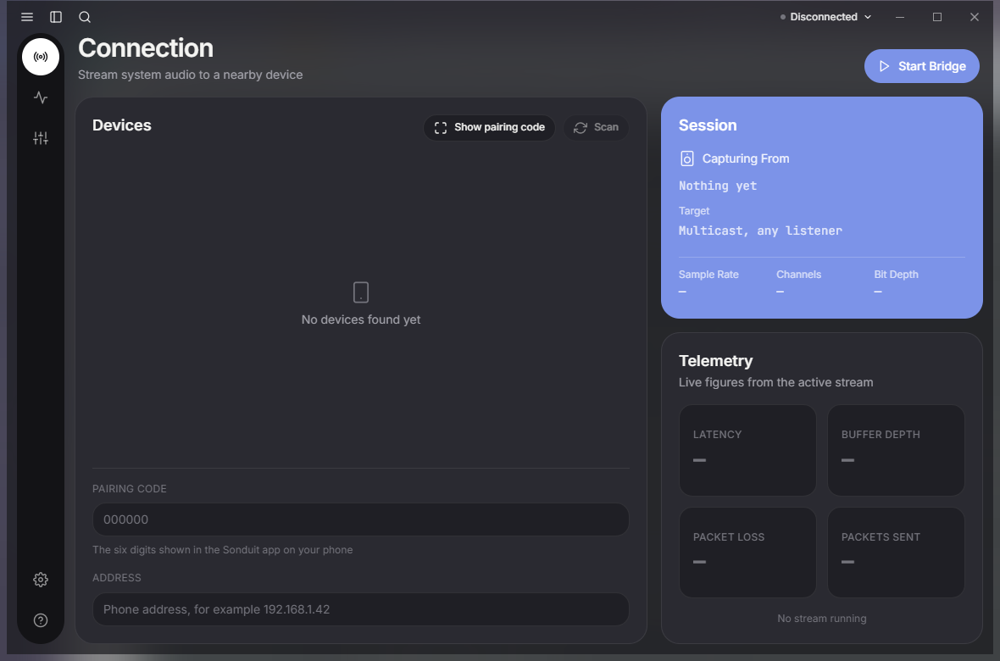
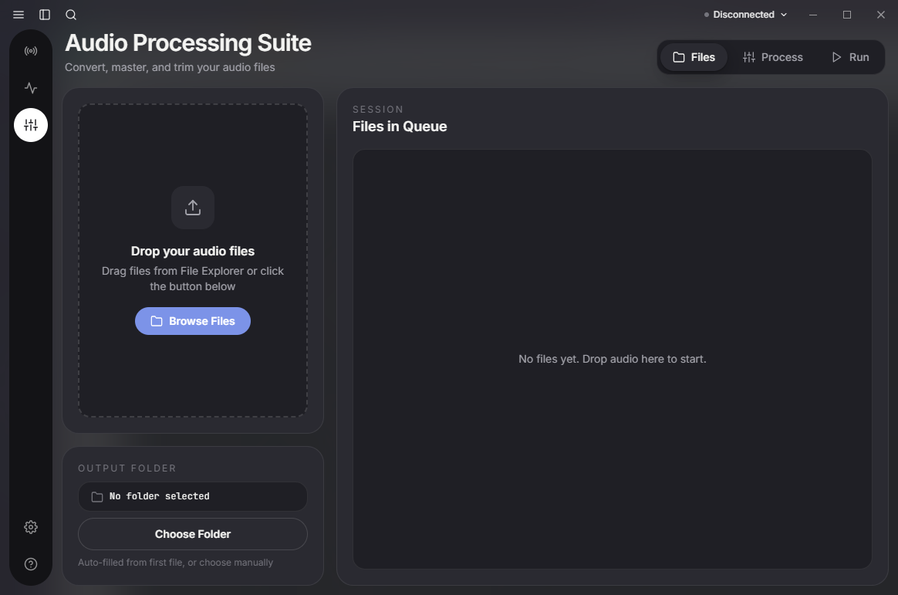

# Sonduit

Low latency system audio bridge from Windows to Android.

  

Sonduit turns an Android phone into an output device for a Windows PC. What the
PC is playing goes to a phone on the same network, over Wi-Fi or over a USB
cable, and comes out there with as little delay as the two operating systems
allow.

It is a Rust workspace with a Tauri desktop app and a Kotlin and Compose Android
app on top of a shared core that has no platform dependencies at all.

**It is not finished.** The [Status](#status) section below says exactly how far
it has got, and is blunt about the difference between what has been measured and
what has only been reasoned about.



## What it does

- **Captures system audio, not the microphone.** WASAPI loopback takes whatever
  Windows is already playing. There is no virtual cable to install and nothing
  to route by hand.
- **Sends it over Wi-Fi or over a USB cable.** The same UDP path either way.
- **Speaks the Scream wire protocol.** Documented byte for byte in
  [docs/protocol.md](docs/protocol.md), derived from MS-PL driver source.
- **Buffers, corrects drift and resamples in a shared core.** The jitter and
  drift logic is one piece of Rust, compiled into both the desktop app and the
  Android app rather than written twice.
- **Pairs before it streams.** A six digit code shown on the phone, or a QR
  code, so an unpaired device cannot be picked by accident.
- **Finds devices on the network** rather than making you type an address,
  though an address can be typed.
- **Shows live telemetry.** Latency, buffer depth, packet loss and packets sent,
  on their own screen.
- **Carries an audio editor.** Convert, master, trim and modify files through a
  bundled FFmpeg.
- **Speaks eleven interface languages.**

Read that list against [Status](#status) before trusting any of it: the parts
that have been exercised on real hardware and the parts that have not are listed
there separately, and the difference is large.

## Running it

**No release has been published yet.** There is no installer and no APK to
download. Nothing has been tagged `release-v*`, so the only way to run Sonduit
today is to build both ends from source.
[docs/roadmap.md](docs/roadmap.md) lists what stands between here and a first
release, riskiest first.

From a clone of this repository, the shared core and the transport need nothing
but Rust:

```bash
cargo test --workspace
```

The desktop app additionally needs Node.js and the Windows C++ toolchain:

```bash
cd desktop
npm ci
npm run tauri dev
```

The phone end is the Gradle project under `android/`. Full toolchain
requirements for both are in [Building](#building).

A physical device is required to judge anything about latency. An emulator is
enough to prove the app starts and no more.

## Status

**Audio has been heard. One session has now been read off the telemetry panel,
and it did not settle.**

### Heard once, and three fixes that are still unproven

Sonduit has run on a physical Android phone over USB tethering, and sound came
out of it. It was also wrong, in two ways that were diagnosed from that
session: the latency the receiver reported swung between roughly 20 and 60 ms
on a repeating cycle, and the audio crackled at the bottom of each swing. Both
are understood, and three fixes for them are in the tree.

**None of those three fixes is known to have run on the phone.** They are
believed to work and are not known to work:

- **The sender declares which link it is on.** Flag bit 0 of the packet header,
  `FLAG_WIRED_LINK` in `crates/sonduit-core/src/packet.rs`. The receiver had
  been guessing from the source address, on the assumption that USB tethering
  means 192.168.42/24; the phone handed out 10.114.89.x, so a wired link was
  sized as Wi-Fi and held 30 ms of buffer where 10 would do.
- **The tethered adapter is identified properly.** The sender asks the routing
  table rather than the address range, and the driver-name match was wrong on
  the two commonest cases: Windows writes "Remote NDIS" with a space and
  `UsbNcm` as one word, so the tokens being matched found nothing at all.
- **The jitter buffer drains at the rate packets arrive.** One packet out per
  packet in, plus a little to make up a genuinely short queue, instead of up to
  three. Draining faster emptied the buffer; an empty buffer stops, refills to
  its target and releases the lot in a burst, which is the swing, and the
  starve at the bottom of each cycle fed concealment into audio that had
  arrived intact, which is the crackle.

So the swing and the crackle should be gone. Somebody has now listened, and the
reading is below. It does not clear those three fixes: the desktop binary that
was running had been built three minutes before the packetiser and the sender's
bridge were last edited, so the reading cannot be credited to any particular
revision of them. The 20-60 ms above still describes the fault that was fixed,
not the product.

### Read once, on 28 August 2026

A session was running and its telemetry was read without disturbing it. A Pixel
7a over USB tethering, 48 kHz / 16-bit / stereo, audio the listener called good.
Seventeen readings over four minutes.

- **Latency 40 ms rising to 69 ms.** It never came back down, and the buffer
  depth behind it went 12, 18, 24, 30, 36, 42 ms without shrinking once. That is
  a session drifting upward, not a session at 40 ms.
- **Packet loss 0.00%**, across roughly forty thousand packets. Nothing was lost
  at any point in the window.
- **The panel understates the path it describes.** Its latency figure covers the
  sender, the network and the receiver's jitter buffer. The phone's own log
  shows a second buffer after that one, between the jitter buffer and the audio
  callback, holding a median of 110 ms that no telemetry reports and no budget
  line covers. Capture to ear was therefore somewhere around 150-180 ms, before
  the AAudio buffer and the device output path are counted at all.

**This is one reading of one session, on one phone, over one cable, taken from
the software's own account of itself.** There was no loopback cable, no Wi-Fi,
no second device and no average over time, and "sounds good and reads 40 ms" is
not a claim that Sonduit achieves 40 ms. What it replaces is "nothing has been
measured", with "one thing has been read, and it found a hole in the
accounting". Every number in
[docs/latency-budget.md](docs/latency-budget.md) is still arithmetic; the
reading is recorded in section 6 there, deliberately outside the budget table.

### What exists and is verified on a machine

- **Windows capture.** WASAPI loopback with a silent render stream to keep the
  engine clocking. Three seconds of wall time produces exactly 144000 frames at
  48 kHz across 300 blocks, and a 440 Hz tone playing on the desktop is
  captured at -21.1 dBFS.
- **The desktop send path, end to end.** `cargo run -p sonduit-desktop --example
  bridge_loopback` opens real capture, sends over a real socket, decodes what
  arrives and writes a WAV. Three seconds: 501 datagrams sent, 501 received,
  none malformed, none lost.
- **The Android app.** Compose UI, a `mediaPlayback` foreground service, AAudio
  output, and a receive path tested against real UDP sockets. It has run on a
  device and played audio.
- **Drift correction that works.** A simulated ten-minute session at 50 ppm,
  which empties an uncorrected buffer completely, settles within 3 ms of target
  in both directions.
- **The audio editor.** Convert, master, trim and modify, run through a bundled
  LGPL FFmpeg. Every mode was verified against the real binary.
- 336 Rust tests, all green on `cargo test --workspace`, plus full CI,
  release automation and language linting.

### What has not been done

- **Nothing has been measured properly on hardware.** One live session has been
  read off the telemetry panel, above, which is the software describing itself
  and is not a measurement. There is still no loopback-cable timing and no
  record of whether AAudio granted exclusive low-latency mode on the phone that
  played. The app reports the granted sharing mode and the burst size, so the
  next session on a device answers most of this; until then every figure in the
  budget is a budget. See [docs/environment.md](docs/environment.md).
- **Wi-Fi has not been heard.** The session that produced sound was over USB
  tethering. The Wi-Fi path shares everything but the interface it binds, and
  that is an argument, not evidence.
- **Tethering has been tried on one phone.** Carrier entitlement can veto USB
  tethering, and OEM builds differ. That remains the largest risk to
  [ADR-004](docs/adr/ADR-004-transport.md).
- **The encryption has not been heard on a phone.** The audio is
  ChaCha20-Poly1305 keyed by an X25519 exchange the pairing code authenticates
  ([ADR-009](docs/adr/ADR-009-audio-encryption.md)), and both ends refuse
  anything else: a paired receiver will not play a cleartext packet and an
  unpaired one will not play a sealed one. That is tested over real loopback
  sockets on both sides and measured at about 2 us a packet, but it has not run
  between this desktop and a real handset, because the phone has been unplugged
  since it landed.
- **A pairing lasts as long as the desktop is open.** Nothing writes the key
  down, so closing the application means pairing again. See
  [docs/roadmap.md](docs/roadmap.md) section 1.2.
- **Windows does not see the phone as a selectable output device.** That
  requires a signed kernel driver, and the prebuilt driver this project
  intended to reuse turns out to be unusable. See
  [ADR-002](docs/adr/ADR-002-desktop-capture.md).

## Targets

| Transport | Target, mouth to ear |
| --- | --- |
| Wi-Fi | 40-80 ms |
| USB tethering | 25-50 ms |

Bluetooth is explicitly out of scope as a transport.

## The audio editor

The editor Harmonix SE was built around is still here, on its own screen.



## Layout

```text
crates/
  sonduit-core/               protocol, ring buffer, jitter, drift, resampling. No I/O, no platform code
  sonduit-transport/          UDP, discovery, sources and sinks
  sonduit-capture-win/        WASAPI capture
  sonduit-playback-android/   AAudio playback
  sonduit-ffi/                UniFFI surface for the Android app
desktop/                      Tauri v2 app: src/ React frontend, src-tauri/ Rust shell
android/                      Gradle project: Kotlin and Compose, Rust through UniFFI
driver/                       vendored driver and install scripts, if one ever ships (ADR-002)
docs/                         architecture decisions, research, protocol, budget
tools/                        linting and version derivation
```

## Building

### What you need

For the shared core and the transport, which is most of the interesting code:

- Rust 1.85 or newer

That is genuinely all. `sonduit-core` has no platform dependencies and does no
I/O, so it builds and tests anywhere, including on a machine with no sound card
(see [ADR-001](docs/adr/ADR-001-shared-core-language.md)).

```bash
cargo test --workspace
```

For the desktop app, additionally:

- Node.js 22 or newer
- On Windows: Visual Studio Build Tools with the C++ workload, and the Windows
  SDK

```bash
cd desktop
npm ci
npm run tauri dev
```

For the Android app, additionally:

- JDK 17
- Android SDK, platform 34 or newer
- Android NDK r27 or newer, with `ANDROID_NDK_HOME` set (CI pins 27.2.12479018)
- `cargo install cargo-ndk`
- `rustup target add aarch64-linux-android armv7-linux-androideabi x86_64-linux-android`

A physical device is required to judge anything about latency. An emulator is
enough to prove the app starts and no more.

### Checks

Run before every commit. CI runs the same set.

```bash
cargo fmt --all --check
cargo clippy --workspace --all-targets -- -D warnings
cargo test --workspace

node tools/lint/check-source-ascii.mjs
node tools/lint/check-commits.mjs HEAD~1..HEAD
node --test tools/version.test.mjs
node tools/version.mjs check
```

## Documentation

Start here:

- [docs/protocol.md](docs/protocol.md) - the wire format, byte for byte. The
  single source of truth.
- [docs/latency-budget.md](docs/latency-budget.md) - where every millisecond is
  meant to go. The measure every pull request is judged against.
- [docs/adr/](docs/adr/) - the architecture decisions and why they were made,
  including three places where research overturned the original plan.
- [docs/research/](docs/research/) - the evidence behind those decisions, with
  sources and an explicit list of what could not be verified.
- [docs/licensing.md](docs/licensing.md) - what is taken from where, and the
  decisions that would force this project to GPL.
- [docs/environment.md](docs/environment.md) - what can and cannot be built and
  verified, and therefore what to distrust.
- [docs/roadmap.md](docs/roadmap.md) - what is next, riskiest first.
- [CONTRIBUTING.md](CONTRIBUTING.md) - layering rules, commit format and
  language conventions.

## Licence

MIT. See [LICENSE](LICENSE).

Sonduit reads the Scream project's MS-PL driver source to document the wire
protocol it speaks. It contains no code from any GPL-licensed project, and the
reasoning is written down in [docs/licensing.md](docs/licensing.md).
